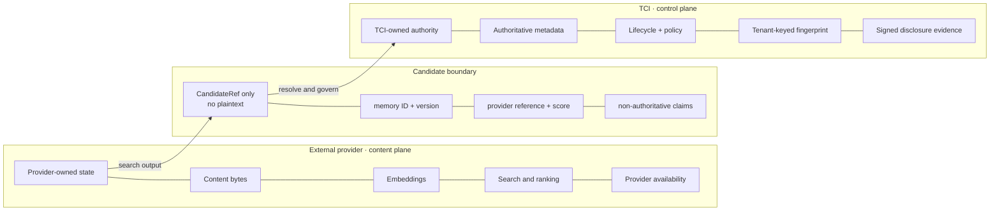
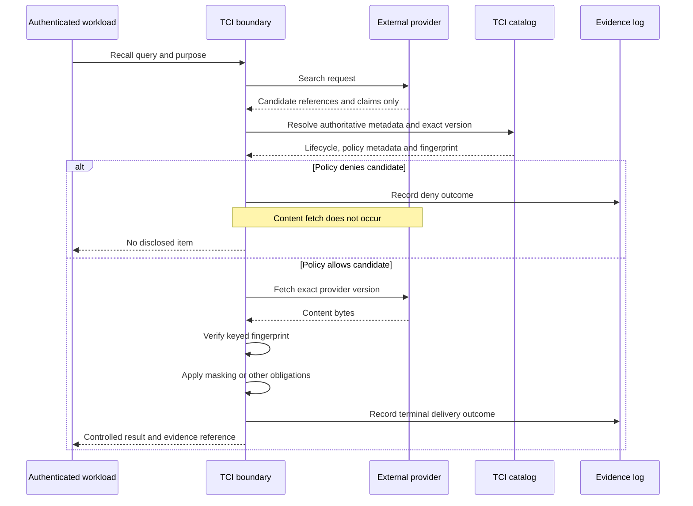
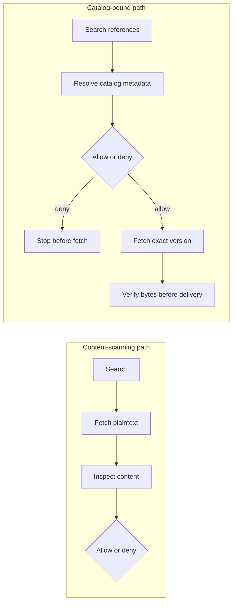

# Catalog-bound authority

## Lifecycle control over records you do not store

[Русская версия](NOTE-RU.md)

> **Status:** experiment report, not a product or production claim.  
> **Evidence:** PA-EXP-03 executable matrix, `10/10 PASS`.  
> **Reproducibility:** internally reproducible; the harness is not public yet.  
> **Scope:** authority enforcement after trusted registration, not authority
> establishment.

---

## At a glance

| Question | Experiment answer | Boundary |
| --- | --- | --- |
| Must TCI store the content to govern its lifecycle? | No | The external provider can retain content, embeddings and search |
| What must TCI control? | An authoritative catalog and the only governed disclosure path | Direct provider bypass must be prevented in production |
| What binds the catalog to the external content? | A tenant-keyed HMAC over the exact bytes supplied at trusted registration | It proves byte continuity, not source truth |
| What is demonstrated? | Exact-version resolution, deny-before-fetch, fingerprint verification, revocation and signed evidence | In-process experiment only |
| What is not demonstrated? | Authority onboarding, production identity/IAM, reconciliation, retrieval completeness and a vendor adapter | These remain explicit gaps |

The current reference evaluator makes decisions from tenant binding, request
purpose and object metadata. It records the actor in evidence, but PA-EXP-03
does **not** demonstrate different policy outcomes for different actors.

## The question

An AI agent needs a long-term-memory record. Before disclosure, the system must
decide whether this exact object version may be used by this authenticated
tenant for this purpose—and later let an independent verifier inspect the
signed record of what TCI decided and delivered within the stated threat
model.

The memory already lives in a vector database, managed memory service or RAG
store. Must a governance layer take custody of those bytes to control their
lifecycle?

## The common binary

Two common answers are both costly.

**Own the store.** Identity, versioning and revocation are easier to control,
but the governance component becomes a memory platform. Adoption now implies
data migration and competition with the customer's existing provider.

**Adapt to the existing store.** Adoption is easy, but caller/provider
metadata becomes policy input. The guarantee degrades to *we faithfully
enforced whatever we were told*.

Both answers assume that authority follows custody: whoever stores the bytes
also decides what is true about them.

## The third arrangement: split the planes

PA-EXP-03 separates the **content plane** from the **control plane**.

| External provider owns | TCI catalog owns |
| --- | --- |
| Content bytes | Identity: `(tenant, memory_id, version)` |
| Embeddings | Provenance reference |
| Similarity search and ranking | Trust level and sensitivity |
| Provider availability | Lifecycle status and policy class |
| Candidate references and non-authoritative claims | Tenant-keyed content fingerprint |



The candidate interface carries references and claims, never content bytes:

```text
CandidateRef(memory_id, version, provider_ref, score)
```

Provider-supplied `trust_level` and `sensitivity` are deliberately present in
the fixture and deliberately ignored. The provider claims
`untrusted/restricted`; the catalog resolves `verified/internal`. The upward
change demonstrates that the provider value is not consulted—not merely used
as a lower bound.

## Decision before content access

The order is the security property.



This differs structurally from a content scanner:



Scanning decides what to do with content already fetched. Catalog-bound
governance can decide whether content may be fetched at all. The two
approaches can be composed; they are not substitutes.

## What the fingerprint actually proves

At trusted registration, the catalog stores a tenant-keyed HMAC over the
**exact content bytes supplied through that registration path**. At reveal,
TCI fetches the requested provider version and recomputes the HMAC over the
returned bytes.

> The fingerprint proves **observed-byte continuity**: the fetched bytes match
> the bytes supplied at trusted catalog registration, except with negligible
> cryptographic collision probability.

It does **not** prove:

- that the source document was true;
- that the registration path obtained the bytes legitimately;
- that the connector reported the provider's source version honestly;
- that the catalog trust level was assigned on sufficient evidence;
- that the provider returned all relevant candidates.

The provider cannot create a valid fingerprint for different bytes without
the tenant metadata key, assuming the key and TCI boundary remain protected.

## Two non-obvious properties

### 1. Deny before fetch

```text
untrusted-catalog-deny-before-content-fetch
provider_fetches_before=1, provider_fetches_after=1
```

The fetch counter does not increase. For this denied candidate, content does
not leave the provider **through the governed TCI path**.

### 2. Revocation without deletion


```text
catalog-revoke-blocks-stale-provider-hit
provider_still_has_object=True
```

TCI does not delete the provider object. It makes that object ineligible for
disclosure through the governed path. Revocation therefore becomes a property
of the disclosure boundary rather than physical storage deletion.

## The precise generalisation

> **After trusted registration, lifecycle-authority enforcement can be
> separated from content custody if every governed disclosure is forced
> through the boundary, the provider supports exact-version fetch, the catalog
> and tenant key are protected, and fetched bytes are verified before
> delivery.**

This pattern can apply beyond agent memory, but only where those conditions can
be enforced. It does not establish source truth, registration authority or
retrieval completeness.

## Assurance boundary

| Demonstrated by PA-EXP-03 | Required for the claim | Not demonstrated |
| --- | --- | --- |
| Provider labels are ignored | Protected catalog and tenant HMAC key | Who may register or promote metadata |
| Missing catalog entry is denied | Trusted registration path | Source truth or source-signed attestation |
| Deny occurs before provider fetch | Exclusive governed disclosure path | Network/IAM bypass prevention |
| Exact advertised version is checked | Provider exact-version capability | Actor-specific policy decisions |
| Changed bytes fail closed | Verification before delivery | Retrieval completeness or ranking integrity |
| Catalog revocation blocks stale provider hit | Fail-closed catalog availability | Reconciliation and concurrent-update ordering |
| Signed package verifies offline | Trusted signer and pinned verifier key | Malicious signer, external audit anchor or model use |

Authority **enforcement** and authority **establishment** remain separate:

- PA-EXP-03 tests enforcement of catalog state after trusted bootstrap;
- PA-EXP-07 tests one isolated quarantine/promotion pattern;
- the two experiments are not connected;
- no production onboarding authority model is claimed.

## Limitations carried by the executable report

The machine-readable PA-EXP-03 report emits these nine limitations:

1. The SQLite provider is experiment-only; no vendor adapter exists.
2. The in-process fixture does not prove network/IAM bypass prevention.
3. The fingerprint proves observed-byte continuity, not source truth.
4. Provider availability, reconciliation and concurrent updates are not
   modelled.
5. Production protocol interfaces and post-filter candidate refill are not
   modelled.
6. Catalog registration is a trusted bootstrap; the origin and sufficiency of
   authority are not verified.
7. PA-EXP-07 two-authority promotion is not connected to catalog registration.
8. `integration-only` and `TCI-custodied` profiles are not implemented.
9. The market gate remains open.

Additional architectural implications of the same topology:

- the provider still controls candidate discovery, ranking and availability;
- it can omit or reorder candidates and degrade retrieval quality, although it
  cannot make an unknown candidate authoritative;
- the current path adds a content fetch for each allowed object;
- the current whole-object fingerprint requires buffering before verified
  release; streaming would require authenticated chunks or another explicit
  streaming-integrity design.

## Executable checks

The harness is not public at the time of this note. The table below is an
**acceptance outline**, not yet a portable conformance suite.

| # | Check | What it establishes |
| ---: | --- | --- |
| 1 | External content is delivered on the allowed path | The topology works with content held outside TCI |
| 2 | Provider claims are not authoritative | Provider trust/sensitivity claims are ignored |
| 3 | Content remains outside the catalog | The catalog stores control data and a fingerprint, not plaintext |
| 4 | Evidence verifies offline | Signed disclosure evidence survives split custody |
| 5 | Untrusted record is denied before fetch | Provider fetch count does not increase on deny |
| 6 | Missing catalog entry is denied | Out-of-band provider objects remain invisible to the governed path |
| 7 | Provider version mismatch is denied | A different advertised version cannot be substituted |
| 8 | Tampered content fails closed | Different fetched bytes fail fingerprint verification |
| 9 | Revoked record remains blocked | Catalog revocation works while provider content remains stored |
| 10 | Candidate interface carries no plaintext | Search returns references and claims only |

All ten checks pass against an in-process SQLite provider standing in for an
external store. The result is **conditional pass: 10/10, with the limitations
above**.

Checks 5 and 9 are the most useful first reproductions: deny-before-fetch and
revocation-without-custody are what distinguish this arrangement from a
metadata wrapper around already-fetched content.

---

*Feedback is especially useful from teams running agent memory on a store they
do not control. The authority-onboarding, direct-bypass, reconciliation,
ranking-integrity and candidate-refill questions remain open.*
