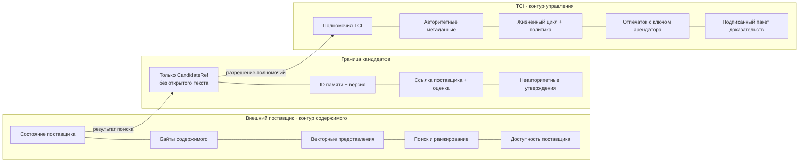
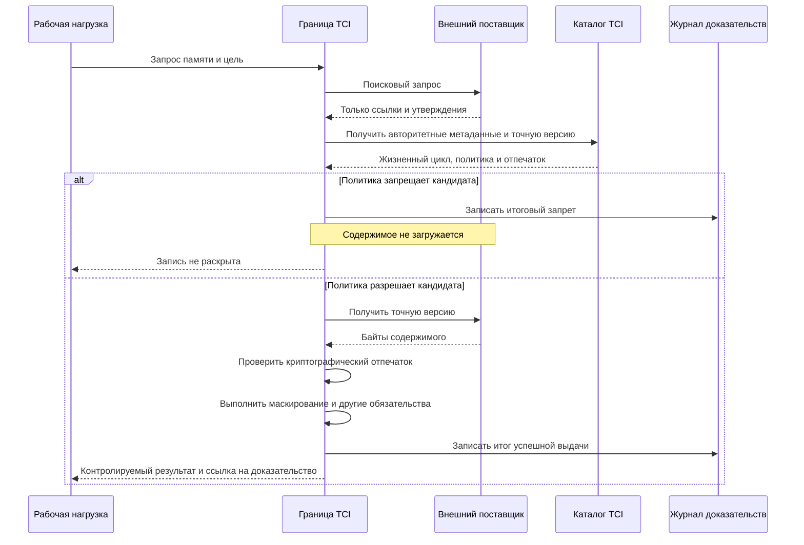
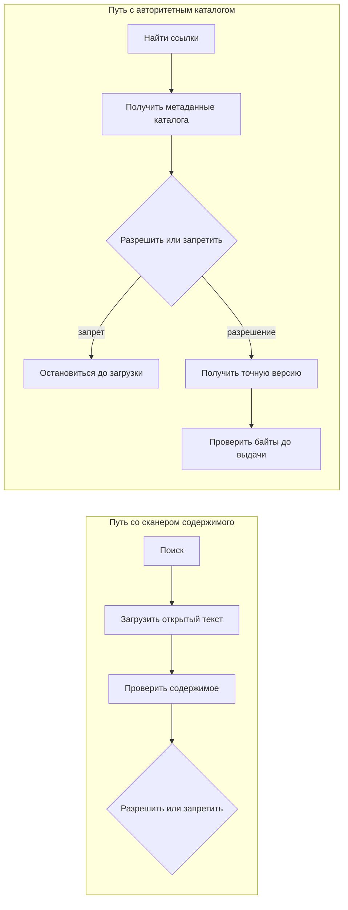
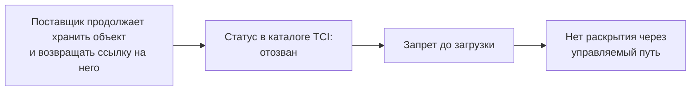

# Catalog-bound authority

## Управление жизненным циклом записей, которые вы не храните

[English version](NOTE-EN.md)

> **Статус:** отчёт об эксперименте, а не заявление о готовом продукте или
> промышленной защите.  
> **Основание:** исполняемая матрица PA-EXP-03, `10/10 PASS` — все десять
> проверок пройдены.  
> **Воспроизводимость:** эксперимент воспроизводится внутри проекта; стенд пока
> не опубликован.  
> **Граница:** проверено исполнение уже установленных полномочий, но не процесс
> их первоначального установления.

---

## Коротко

| Вопрос | Ответ эксперимента | Ограничение |
| --- | --- | --- |
| Должен ли TCI хранить содержимое, чтобы управлять его жизненным циклом? | Нет | Внешний поставщик может сохранить содержимое, векторные представления и поиск |
| Что должен контролировать TCI? | Авторитетный каталог и единственный управляемый путь раскрытия | В промышленной системе необходимо запретить прямой обход TCI |
| Что связывает каталог с внешним содержимым? | HMAC конкретного арендатора, рассчитанный от точных байтов, переданных при доверенной регистрации | Он доказывает неизменность наблюдавшихся байтов, но не истинность источника |
| Что проверено? | Точная версия, запрет до загрузки, проверка отпечатка, отзыв и подписанный пакет доказательств | Только внутрипроцессный эксперимент |
| Что не проверено? | Первичное установление полномочий, промышленная идентификация/IAM, согласование изменений, полнота поиска и адаптер реального поставщика | Это открытые вопросы |

Текущий эталонный вычислитель политик принимает решение по арендатору, цели
запроса и метаданным объекта. Участник запроса записывается в доказательства,
но PA-EXP-03 **не проверяет**, что разные участники получают разные решения.

## Вопрос

Агенту искусственного интеллекта нужна запись из долговременной памяти. До её
раскрытия система должна решить, разрешено ли использовать именно эту версию
объекта данному аутентифицированному арендатору для указанной цели. После этого
независимый проверяющий должен иметь возможность проверить подписанную запись
о том, какое решение принял TCI и что он выдал — в пределах заявленной модели
угроз.

Но сама память уже находится во внешней векторной базе, управляемом сервисе
памяти или RAG-хранилище. Обязан ли защитный слой забрать содержимое себе,
чтобы управлять его жизненным циклом?

## Обычная ложная развилка

Чаще всего предлагаются два дорогих варианта.

**Владеть хранилищем.** Проще контролировать идентичность объектов, версии и
отзыв. Но защитный компонент превращается в новую платформу памяти. Заказчику
нужно переносить данные и отказываться от части уже выбранной инфраструктуры.

**Работать поверх существующего хранилища.** Подключение проще, но метаданные
поступают от вызывающего кода или поставщика. Гарантия ослабевает до фразы:
*мы точно исполнили то, что нам сообщили*.

Оба варианта предполагают, что полномочия следуют за хранением: кто держит
байты, тот и решает, что о них считать истинным.

## Третий вариант: разделить два контура

PA-EXP-03 разделяет **контур содержимого** и **контур управления**.

| Внешний поставщик отвечает за | Каталог TCI отвечает за |
| --- | --- |
| Байты содержимого | Идентичность: `(арендатор, идентификатор памяти, версия)` |
| Векторные представления | Ссылку на происхождение |
| Семантический поиск и ранжирование | Уровень доверия и чувствительность |
| Доступность поставщика | Состояние жизненного цикла и класс политики |
| Ссылки на кандидатов и неавторитетные утверждения | Криптографический отпечаток содержимого с ключом арендатора |



Интерфейс кандидатов переносит только ссылки и утверждения, но не содержимое:

```text
CandidateRef(memory_id, version, provider_ref, score)
СсылкаНаКандидата(ID_памяти, версия, ссылка_поставщика, оценка_сходства)
```

Поля `trust_level` — «уровень доверия» — и `sensitivity` — «уровень
чувствительности» — намеренно присутствуют в тестовом ответе поставщика и
намеренно игнорируются. Поставщик сообщает `untrusted/restricted` —
«недоверенный/ограниченный», — а каталог разрешает `verified/internal` —
«проверенный/внутренний». Повышение относительно значения поставщика
показывает, что его утверждение вообще не использовалось, а не просто
считалось нижней границей.

## Решение принимается до доступа к содержимому

Порядок операций сам является свойством безопасности.



Это принципиально отличается от проверки содержимого сканером:



Сканер решает, что делать с уже загруженным содержимым. Каталог TCI позволяет
решить, можно ли вообще загружать это содержимое. Два подхода могут работать
вместе и не заменяют друг друга.

## Что именно доказывает криптографический отпечаток

При доверенной регистрации каталог сохраняет HMAC с ключом конкретного
арендатора, рассчитанный от **точных байтов содержимого, переданных через путь
регистрации**. При раскрытии TCI получает требуемую версию у поставщика и снова
вычисляет HMAC от возвращённых байтов.

> Отпечаток доказывает **непрерывность наблюдавшихся байтов**: полученные байты
> совпадают с байтами, переданными при доверенной регистрации каталога, кроме
> пренебрежимо малой вероятности криптографической коллизии.

Он **не доказывает**:

- истинность исходного документа;
- законность получения байтов путём регистрации;
- честность сообщённой коннектором версии источника;
- достаточность оснований для присвоенного уровня доверия;
- полноту и релевантность кандидатов, возвращённых поставщиком.

Поставщик не может построить правильный отпечаток для других байтов без ключа
метаданных арендатора — при условии, что ключ и граница TCI защищены.

## Два неочевидных свойства

### 1. Запрет до загрузки

```text
untrusted-catalog-deny-before-content-fetch
загрузок_до=1, загрузок_после=1
```

Счётчик не увеличился. Для запрещённого кандидата содержимое не покинуло
поставщика **через управляемый путь TCI**.

### 2. Отзыв без удаления



```text
catalog-revoke-blocks-stale-provider-hit
provider_still_has_object=True — поставщик продолжает хранить объект
```

TCI не удаляет объект у поставщика. Он делает объект недопустимым для
раскрытия через управляемый путь. Отзыв становится свойством границы раскрытия,
а не физического удаления из хранилища.

## Точная формулировка обобщения

> **После доверенной регистрации исполнение полномочий на жизненный цикл можно
> отделить от хранения содержимого, если вся управляемая выдача обязательно
> проходит через защитную границу, поставщик умеет получать точную версию,
> каталог и ключ арендатора защищены, а полученные байты проверяются до
> выдачи.**

Подход применим не только к памяти агентов, но лишь там, где можно обеспечить
все перечисленные условия. Он не устанавливает истинность источника,
полномочия на регистрацию или полноту поиска.

## Граница доказанного

| Проверено PA-EXP-03 | Необходимо для гарантии | Не проверено |
| --- | --- | --- |
| Утверждения поставщика игнорируются | Защищённые каталог и ключ HMAC арендатора | Кто вправе регистрировать и повышать доверие |
| Неизвестная каталогу запись запрещается | Доверенный путь регистрации | Истинность источника и подписанное подтверждение источника |
| Запрет происходит до загрузки | Единственный управляемый путь раскрытия | Защита от прямого обхода через сеть/IAM |
| Проверяется заявленная точная версия | Способность поставщика получить точную версию | Разные политики для разных участников |
| Изменённые байты блокируются | Проверка до выдачи | Полнота поиска и честность ранжирования |
| Отзыв блокирует устаревший результат поставщика | Отказ по умолчанию при недоступности каталога | Согласование изменений и порядок конкурентных обновлений |
| Подписанный пакет проверяется без доступа к системе | Доверенный подписант и закреплённый ключ проверки | Злонамеренный подписант, внешний якорь аудита и использование данных моделью |

Необходимо различать два понятия:

- **исполнение полномочий** — PA-EXP-03 проверяет соблюдение уже принятого
  состояния каталога после доверенной первоначальной загрузки;
- **установление полномочий** — кто и на каких основаниях вправе создать
  запись каталога или повысить её уровень доверия.

PA-EXP-07 отдельно проверяет один экспериментальный вариант карантина и
повышения доверия. PA-EXP-03 и PA-EXP-07 не соединены. Промышленная модель
первичной регистрации пока не заявляется.

## Ограничения из исполняемого отчёта

Машиночитаемый отчёт PA-EXP-03 выдаёт девять ограничений:

1. SQLite-поставщик существует только для эксперимента; адаптера реального
   поставщика нет.
2. Внутрипроцессный стенд не доказывает защиту от прямого сетевого или
   IAM-обхода.
3. Отпечаток доказывает непрерывность наблюдавшихся байтов, а не истинность
   источника.
4. Недоступность поставщика, согласование и конкурентные обновления не
   моделируются.
5. Промышленные протокольные интерфейсы и добор кандидатов после фильтрации не
   моделируются.
6. Регистрация каталога является доверенной первоначальной загрузкой;
   происхождение и достаточность полномочий не проверяются.
7. Повышение доверия по двум независимым основаниям из PA-EXP-07 не подключено
   к регистрации каталога.
8. Профили `integration-only` — «только интеграция» — и `TCI-custodied` —
   «содержимое под ответственным хранением TCI» — не реализованы.
9. Рыночные ворота проекта остаются непройденными.

Дополнительные архитектурные следствия:

- поставщик продолжает контролировать поиск, ранжирование и доступность;
- он может скрыть или переставить кандидатов и ухудшить качество поиска, хотя
  не может сделать неизвестного кандидата авторитетным;
- текущий путь добавляет загрузку содержимого для каждого разрешённого
  объекта;
- текущий отпечаток целого объекта требует буферизации до проверенной выдачи;
  потоковая выдача потребует аутентифицированных фрагментов или отдельной
  схемы контроля целостности потока.

## Исполняемые проверки

На момент подготовки документа стенд ещё не опубликован. Таблица ниже — это
**схема приёмочных проверок**, а не переносимый набор проверки соответствия.

| № | Проверка | Что она подтверждает |
| ---: | --- | --- |
| 1 | Разрешённое внешнее содержимое выдано | Схема работает, когда содержимое находится вне TCI |
| 2 | Утверждения поставщика неавторитетны | Заявленные поставщиком доверие и чувствительность игнорируются |
| 3 | Содержимое не хранится в каталоге | В каталоге находятся управляющие данные и отпечаток, но не открытый текст |
| 4 | Пакет доказательств проверяется автономно | Подписанное доказательство сохраняется при разделённом хранении |
| 5 | Недоверенная запись запрещена до загрузки | При запрете счётчик загрузок поставщика не увеличивается |
| 6 | Отсутствующая в каталоге запись запрещена | Добавленные в обход объекты невидимы управляемому пути |
| 7 | Несовпадение версии запрещено | Поставщик не может подставить другую заявленную версию |
| 8 | Изменённое содержимое блокируется | Другие полученные байты не проходят проверку отпечатка |
| 9 | Отозванная запись остаётся заблокированной | Отзыв действует, хотя содержимое продолжает храниться у поставщика |
| 10 | Интерфейс кандидатов не переносит открытый текст | Поиск возвращает только ссылки и утверждения |

Все десять проверок проходят на внутрипроцессном SQLite-поставщике, который
имитирует внешнее хранилище. Результат: **условный успех — 10/10 с указанными
ограничениями**.

В первую очередь стоит воспроизводить проверки 5 и 9: запрет до загрузки и
отзыв без хранения содержимого отличают эту схему от обычной оболочки над уже
загруженными данными.

## Словарь сокращений и терминов

| Термин | Полная форма / перевод | Значение в документе |
| --- | --- | --- |
| **TCI** | *Trusted Cognitive Infrastructure* — доверенная когнитивная инфраструктура | Исследуемый слой управления памятью и контекстом агентов |
| **AI / ИИ** | *Artificial Intelligence* — искусственный интеллект | Агент или система, использующая модели ИИ |
| **RAG** | *Retrieval-Augmented Generation* — генерация с дополнением извлечёнными данными | Получение внешних документов или фрагментов перед обращением к модели |
| **PA-EXP-03** | *Production Architecture Experiment 03* — эксперимент №3 по производственной архитектуре | Проверяемая схема с привязкой к авторитетному каталогу (`catalog-bound`) |
| **PA-EXP-07** | *Production Architecture Experiment 07* — эксперимент №7 по производственной архитектуре | Отдельный эксперимент с карантином и повышением доверия; с PA-EXP-03 не соединён |
| **HMAC** | *Hash-based Message Authentication Code* — код аутентификации сообщения на основе хеш-функции | Криптографический отпечаток с секретным ключом |
| **IAM** | *Identity and Access Management* — управление идентификацией и доступом | Сетевые и инфраструктурные правила доступа к TCI и поставщику |
| **ID** | *Identifier* — идентификатор | Уникальное обозначение записи памяти |
| **SQLite** | Встраиваемая реляционная база данных | Используется только в экспериментальном стенде |
| **Tenant / арендатор** | Изолированная организация или область данных | Граница разделения клиентов и ключей |
| **Actor / участник** | Пользователь, сервис или агент, инициировавший запрос | Сейчас фиксируется в доказательствах, но не влияет на решение локальной политики |
| **Purpose / цель** | Заявленное назначение запроса | Один из входов решения политики |
| **Content custody / ответственное хранение содержимого** | Физическое хранение и контроль байтов | В catalog-bound схеме остаётся у внешнего поставщика |
| **Content plane / контур содержимого** | Хранилище, поиск и фактические байты | Остаётся у внешнего поставщика |
| **Control plane / контур управления** | Каталог, правила, жизненный цикл и доказательства | Находится под контролем TCI |
| **Metadata / метаданные** | Управляющие сведения о записи | Версия, происхождение, доверие, чувствительность и состояние |
| **Authority / полномочия, авторитетность** | Право определять доверенные метаданные и жизненный цикл | Принадлежит каталогу TCI после доверенной регистрации |
| **Lifecycle / жизненный цикл** | Состояния записи: активна, отозвана, заменена и другие | Используется для решения о раскрытии |
| **Provenance / происхождение** | Сведения об источнике и истории записи | Метаданные каталога; сами по себе не доказывают истинность источника |
| **Policy / политика** | Машиноисполняемые правила доступа и раскрытия | Решает: разрешить, запретить или применить обязательства |
| **Obligation / обязательство** | Требуемое действие после разрешения | Например, маскирование данных перед выдачей |
| **Disclosure / раскрытие** | Передача содержимого получателю | Управляемая операция, которую фиксирует TCI |
| **Candidate / кандидат** | Результат внешнего поиска до окончательного разрешения | Содержит ссылку и неавторитетные утверждения, но не открытый текст |
| **Fingerprint / отпечаток** | Криптографическая привязка к точным байтам | Позволяет обнаружить подмену содержимого |
| **Exact version / точная версия** | Конкретная неизменяемая редакция объекта | Не должна незаметно заменяться текущим содержимым |
| **Plaintext / открытый текст** | Незашифрованное содержимое | Не передаётся через интерфейс кандидатов |
| **Fail-closed / отказ с запретом** | При ошибке операция не продолжается | Необходимое поведение проверки отпечатка и каталога |
| **Bootstrap / первоначальная доверенная загрузка** | Начальное создание записи каталога доверенным путём | Эксперимент принимает этот путь как предпосылку |
| **Source truth / истинность источника** | Доказательство того, что исходные данные верны и получены законно | Отпечаток этого не доказывает |
| **Direct bypass / прямой обход** | Доступ к поставщику в обход TCI | Должен быть запрещён сетью и IAM в промышленной схеме |
| **Post-filter refill / добор после фильтрации** | Запрос дополнительных кандидатов после отклонения первых результатов | В эксперименте не моделируется |
| **Evidence Package / пакет доказательств** | Подписанный переносимый набор событий и метаданных | Проверяется отдельно без доступа к работающей системе |
| **Offline verifier / автономный верификатор** | Программа проверки пакета без подключения к TCI | Проверяет подпись, цепочку и внутреннюю согласованность |

---

*Особенно полезна обратная связь от команд, которые используют память агентов
во внешнем хранилище. Открытыми остаются вопросы первоначального установления
полномочий, прямого обхода, согласования изменений, честности ранжирования и
добора кандидатов.*
